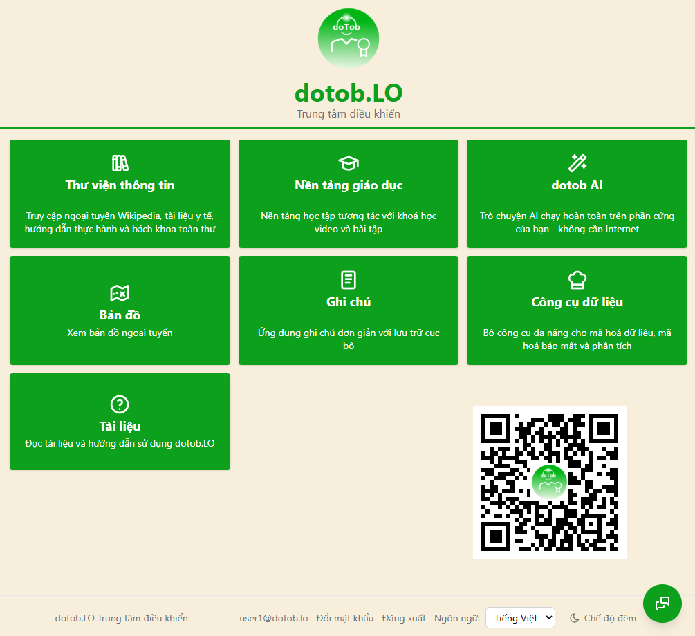
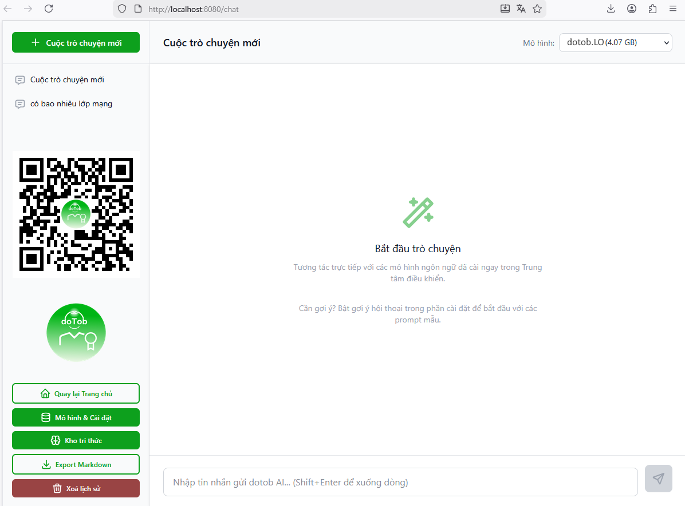
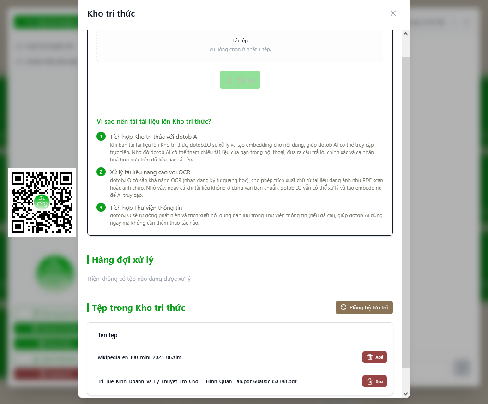
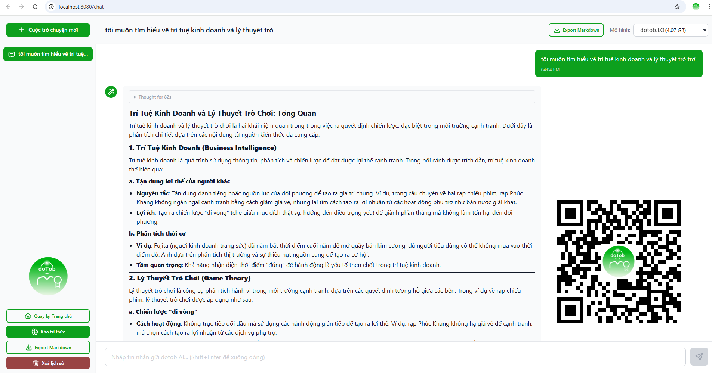
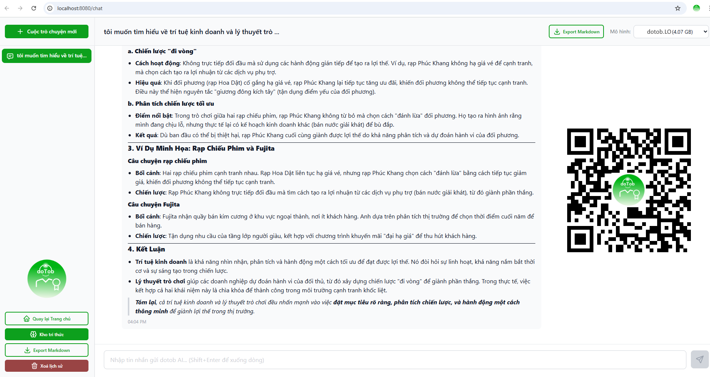

# dotob_lo
dotob.LO – Hệ thống máy chủ tri thức ngoại tuyến cá nhân, giúp bạn vận hành một bộ công cụ "tự chủ thông tin" ngay trong mạng nội bộ của mình.

  

  # dotob.LO
  ### Trung tâm điều khiển (Command Center) — Offline-first Knowledge & Tools
  Tích hợp phát triển bởi <a href="https://ictso.top" target="_blank">ICTSO.</a>

---

<a href="https://86.pro.vn/" target="_blank">dotob.LO</a> là hệ thống quản trị và điều phối một bộ công cụ chạy bằng Docker, tập trung vào trải nghiệm offline-first: kiến thức, giáo dục và công cụ dữ liệu cá nhân tại nhà bạn và các cơ sở tương ứng. 
Xem chi tiết thông tin <a href="https://ictso.top/tailieu/dotoblo/" target="_blank"> tại đây dotob.LO</a>
## Hình ảnh giao diện

  

  
  
  
  

## Triển khai (Online/Offline)
Các file đóng gói v1.0 nằm trong thư mục `install/`:
Cài đặt theo hệ điều hành: (chọn một trong những phương án cài đặt sau cho phù hợp)

### Hướng dẫn cài đặt trên Windows (WSL2 + Docker Desktop) — Online hoặc Offline
Hướng dẫn cài đặt dotob_lo trên Windows (WSL2 + Docker Desktop) — Online hoặc Offline: <a href="install/INSTALL_WINDOWS_DOCKER_DESKTOP.md" target="_blank">`install/INSTALL_WINDOWS_DOCKER_DESKTOP.md`</a>

### Hướng dẫn cài đặt trên Linux (Docker Engine + Docker Compose V2) — Online hoặc Offline (đề xuất nên sử dụng)
Hướng dẫn cài đặt dotob_lo trên Linux (Docker Engine + Docker Compose V2) — Online hoặc Offline: <a href="install/INSTALL_LINUX_DOCKER_ENGINE.md" target="_blank">`install/INSTALL_LINUX_DOCKER_ENGINE.md`</a>

### Hướng dẫn cài đặt trên macOS (Docker Desktop) — Online hoặc Offline
Hướng dẫn cài đặt dotob_lo trên macOS (Docker Desktop) — Online hoặc Offline: <a href="install/INSTALL_MACOS_DOCKER_DESKTOP.md" target="_blank">`install/INSTALL_MACOS_DOCKER_DESKTOP.md`</a>

### Online (đề xuất nên sử dụng)
Cài đặt tự động (khuyến nghị):
Hướng dẫn chi tiết cài đặt Online: <a href="install/INSTALL_ONLINE.md" target="_blank">`install/INSTALL_ONLINE.md`</a>

### Offline (không cần Internet ở máy đích):
Đóng gói offline kèm toàn bộ image app để cài app khi không có Internet 
Hướng dẫn chi tiết cài đặt Online: <a href="install/INSTALL_OFFLINE.md" target="_blank">`install/INSTALL_OFFLINE.md`</a>

## Các thành phần chính

- Thư viện thông tin: Kiwix
- Nền tảng giáo dục: Kolibri
- Trợ lý AI cục bộ: dotob AI
- Công cụ dữ liệu: CyberChef
- Ghi chú: FlatNotes

## Nguồn gốc dự án
dotob.LO được xây dựng tích hợp cho thị trường Việt Nam bởi <a href="https://ictso.top/blog/s%E1%BA%A3n-ph%E1%BA%A9m/" target="_blank">ICTSO.</a>

                <h3 style="margin: 0 0 15px 0;">LIÊN HỆ TƯ VẤN </h3>
                
<strong>Hotline:</strong> <a href="tel:0986379601">0986.379.601</a> | 
				<a href="https://zalo.me/0986379601" title="Zalo">Zalo</a> 

                
<strong>Website:</strong> <a href="https://ictso.top">ictso.top</a> | <a href="https://qnict.net">qnict.net</a>

                
<strong>Email:</strong> <a href="mailto:ictso.top@gmail.com">support@ictso.top</a>

                
<strong>Chi tiết:</strong> <a href="https://ictso.top/tailieu/dotoblo/">https://ictso.top/tailieu/dotoblo/</a>

            

## License
Apache License 2.0: xem [LICENSE](LICENSE).

